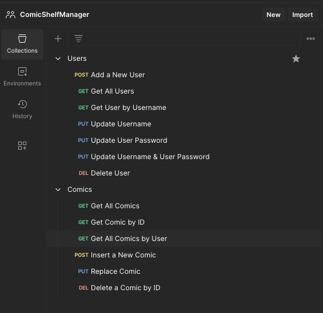

Comic Shelf Manager - Revature Paired Programming Project

## Overview

This repository contains a paired programming project designed to test and showcase our knowledge in Spring Boot, JPA, and related technologies. The project is part of a collaborative effort to build a basic user/item management application with a focus on backend functionalities.

## Personal Inspiration
For this project, I chose to focus on collectible items, specifically comics, because of my personal passion for comic collection. As an avid collector, the idea of creating an application that could help manage and catalog my collection was both a practical and exciting challenge. This project not only allowed me to develop my skills in software development but also gave me a platform to merge my hobby with my professional interests.

## Objective

The main goal of the project is to implement a simple yet functional application that demonstrates our grasp of the fundamental concepts of Spring Boot and Java Persistence API (JPA). It involves creating two related database tables and developing the necessary CRUD (Create, Read, Update, Delete) operations.

## Development Tools Visuals

The ER diagram visualizes the database schema used within the application, and the Postman collection demonstrates the various API endpoints available for testing.

  
   

## Features

- RESTful service creation using Spring Boot.
- Data persistence managed with JPA.
- Custom queries with Spring Data JPA.
- Exception handling and validation.

For the project summary and requirements, see [Project Requirements](PROJECT_REQUIREMENTS.md).

## Tools and Development Environment
This project was developed using a combination of high-level tools and technologies that ensured a robust development environment geared towards efficiency and best practices. Here's a detailed look at the tools employed and their roles in the project:

- **Spring Boot**: Used for creating the framework of our RESTful services. It served as the backbone for the backend development, providing a comprehensive environment for building scalable web applications.
- **Java Persistence API (JPA)**: Utilized for database interaction and object-relational mapping, allowing us to manage our PostgreSQL database efficiently and integrate seamlessly with our backend application.
- **PostgreSQL**: The primary database management system used for this project. PostgreSQL provided a reliable and powerful database platform for storing and retrieving our data efficiently, which was crucial for supporting the application's data persistence needs.
- **DBeaver**: Served as the database management tool for our PostgreSQL database, helping us handle database schema visualization and manipulation. DBeaver was instrumental in managing and setting up the database structures required for the project, offering an intuitive interface for database administration.
- **Postman**: Employed for testing and interacting with the REST API. This tool was crucial in ensuring all functionalities performed as expected and allowed us to verify the end-to-end functionality of our services.

Each tool played a critical role in the development process, from backend programming and database management to testing and API interaction, ensuring that the project was well-supported through its various development stages.

